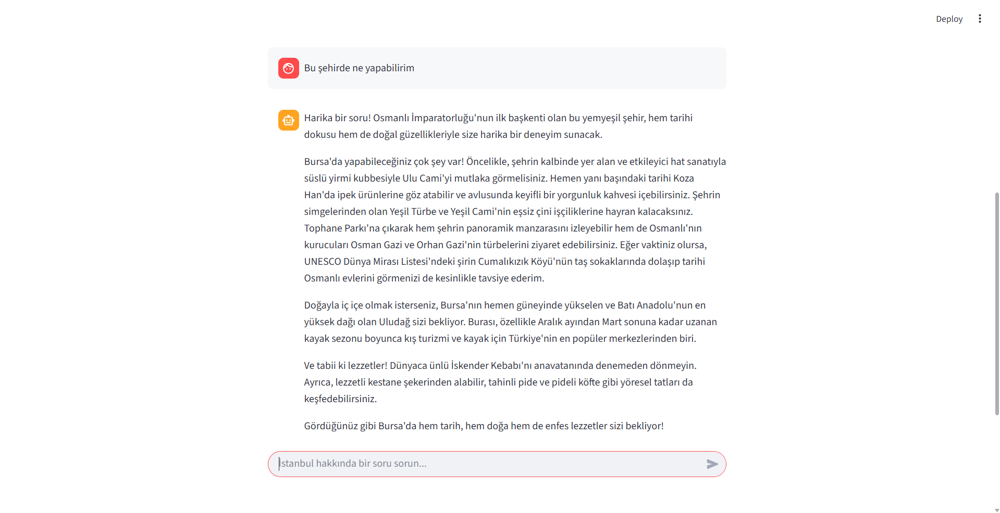

# Türkiye Turizm Chatbotu

Bu proje, RAG (Retrieval Augmented Generation) tabanlı bir chatbot'tur. Chatbot, Türkiye'deki şehirlerde gezilecek yerler ve yapılacak aktiviteler hakkında bilgi vermek için tasarlanmıştır. 

## Veri Seti

Bu proje için `turkiye_turizm.txt`  adında tek bir metin dosyası kullanılmıştır.

**İçerik**: Bu dosya, Türkiye' deki 81 il hakkında tarihi ve kültürel bilgilerin yanı sıra görülmesi gereken yerler hakkında da bilgi içermektedir.

**Hazırlanışı**: Veri seti, proje kapsamında çeşitli web sitelerinden (GoTürkiye, Wikipedia) alınan bilgilerin düzenlenmesiyle hazırlanmıştır. RAG mimarisi, bu metin dosyasını `RecursiveCharacterTextSplitter` kullanarak 1000 karakterlik parçalara bölerek bilgi kaynağı olarak kullanmaktadır.

## Kullanılan Yöntemler ve Çözüm Mimarisi

Bu projede, LangChain kütüphanesi kullanılarak bir RAG (Retrieval Augmented Generation) mimarisi oluşturulmuştur.

**Mimari Akışı:**

1.  **Veri Yükleme (`TextLoader`):** `turkiye_turizm.txt` dosyası okunur.
2.  **Parçalama (`RecursiveCharacterTextSplitter`):** Metin, 1000 karakterlik, 200 karakter örtüşmeli parçalara (chunk) bölünür.
3.  **Embedding (`GoogleGenerativeAIEmbeddings`):** Her metin parçası, Google'ın `models/embedding-001` modeli kullanılarak vektör temsillerine dönüştürülür.
4.  **Vektör Depolama (`Chroma`):** Elde edilen vektörler, hızlı arama yapabilmek için bir `Chroma` vektör veritabanına yüklenir.
5.  **Sorgulama (`ConversationalRetrievalChain`):** Kullanıcı bir soru sorduğunda:
    * **Hafıza (`ConversationBufferMemory`):** Sohbet geçmişi, takip sorularını anlamlandırmak için kullanılır (Örn: "Peki orada ne yenir?" -> "Konya'da ne yenir?").
    * **Retriever:** Kullanıcının sorusu vektöre dönüştürülür ve `Chroma` veritabanında en alakalı 4 metin parçası (chunk) bulunur.
    * **LLM (`gemini-2.5-flash`):** Bulunan alakalı metin parçaları ve kullanıcının sorusu, "yardımsever bir turizm rehberi" olmasını söyleyen özel bir prompt (`QA_PROMPT`) ile `gemini-2.5-flash` modeline gönderilir.
6.  **Cevap:** Model, yalnızca sağlanan metin parçalarına dayanarak akıcı ve sohbet havasında bir cevap üretir.

**Kullanılan Teknolojiler:**

* **Generation Model:** `gemini-2.5-flash`
* **Embedding Model:** `models/embedding-001`
* **Vektör Veritabanı:** `ChromaDB`
* **RAG Pipeline Framework:** `LangChain`
* **Web Arayüzü:** `Streamlit`
* **Bağımlılık Yönetimi:** `python-dotenv`

## 4. Elde Edilen Sonuçlar

Proje sonucunda, `turkiye_turizm.txt`  belgesindeki bilgilerle sınırlı, "🇹🇷 Discover Türkiye Chatbot" adında fonksiyonel bir web uygulaması geliştirilmiştir.

* Chatbot, kendisine verilen metin kaynağının dışına çıkmadan soruları yanıtlamaktadır.
* Sohbet hafızası sayesinde, kullanıcıların "peki", "orası", "başka neler var?" gibi takip sorularını önceki şehir bağlamına göre doğru bir şekilde yeniden ifade edip cevaplayabilmektedir.
* Streamlit arayüzü sayesinde kullanımı kolay ve interaktif bir deneyim sunmaktadır.

## 5. Çalışma Kılavuzu

Projenin lokal makinede çalıştırılması için gereken adımlar.

1.  **Repoyu Klonlayın:**
    ```bash
    git clone https://github.com/nisanseymen/turkiye-turizm-chatbot.git
    cd turkiye-turizm-chatbot
    ```

2.  **Virtual Environment (Sanal Ortam) Kurulumu:**
    ```bash
    python -m venv venv
    ```
    * Windows: `venv\Scripts\activate`
    * MacOS/Linux: `source venv/bin/activate`

3.  **Bağımlılıkların Yüklenmesi:**
    `requirements.txt` dosyasındaki kütüphaneleri yükleyin:
    ```bash
    pip install -r requirements.txt
    ```

4.  **.env Dosyası Oluşturun:**
    Uygulamanın çalışması için bir Google API anahtarına ihtiyacı vardır. Ana dizinde `.env` adında bir dosya oluşturun ve içine şunu ekleyin:
    ```
    GOOGLE_API_KEY="AIStudio-uzerinden-aldiginiz-api-anahtari"
    ```

5.  **Streamlit Uygulamasını Çalıştırın:**
    Aşağıdaki komut ile web arayüzünü başlatın:
    ```bash
    streamlit run app.py
    ```

## 6. Web Arayüzü & Product Kılavuzu

Uygulama çalıştırıldığında, "🇹🇷 Discover Türkiye Chatbot" başlıklı bir sohbet arayüzü açılır.

* **Kullanım:** Alttaki sohbet kutusuna Türkiye'deki şehirlerle ilgili sorularınızı yazabilirsiniz (Örn: "İstanbul'da nereye gidebilirim?", "Türkiye'de nerde kayak yapabilirim?", "Hatay'da ne yenir?").
* **Sohbet Akışı:** Chatbot, `turkiye_turizm.txt`  dosyasındaki bilgilere göre size cevap verecektir. Takip soruları sorabilirsiniz.




### Deploy Linki
https://huggingface.co/spaces/nisanseymen/turkiye-turizm-chatbot
